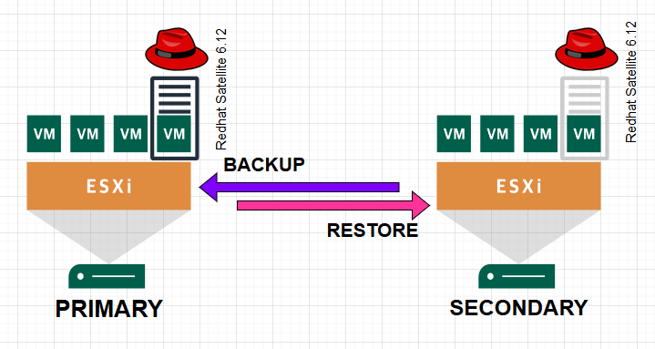
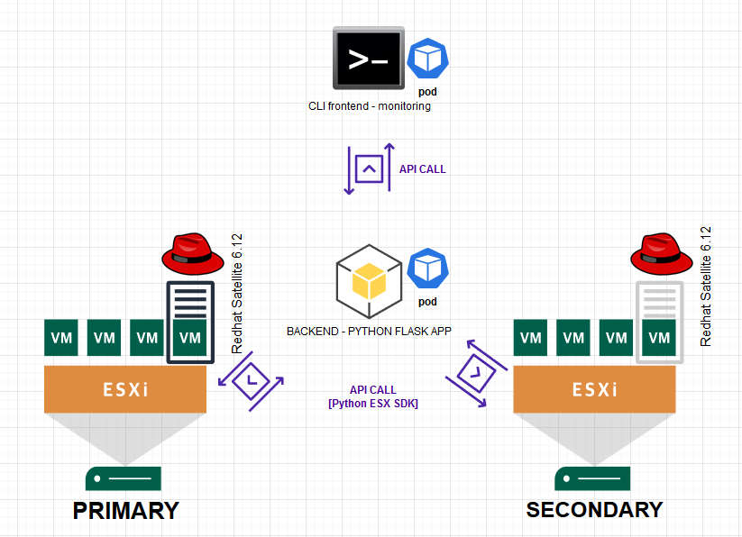

# sudo su - SRE #Ep001
# Disaster Recovery solution for Red Hat Satellite
Chapter 10 of the system administration manual implies there is no native DR solution for Satellite:  
https://access.redhat.com/documentation/en-us/red_hat_satellite/6.12/html/administering_red_hat_satellite/backing-up-satellite-server-and-capsule_admin   
Whats recommended is the old good backup/restore.  
!! Keep in mind that only one instance of Satellite should be active at anytime.  

## Step 0: Traditional & Manual

0. **Topology**
   
   
   
1. **backup primary**
   
   ```bash
   vgcreate backup_vg /dev/sdc
   lvcreate -n backup_lv -L 500G backup_vg
   mkfs.xfs /dev/backup_vg/backup_lv
   mkdir /backup
   setfacl -R -m u:postgres:rwx /backup/
   setfacl -R -m d:u:postgres:rwx /backup/
   satellite-maintain backup offline /backup
   scp -r satellite-backup-2023-10-31-16-10-32/ localadmin@172.22.56.21:/backup/
   ```
   
2. **restore seondary**
   * prior, setup a second VM in the DR site with the same IP/fqdn, but powered off.
   * 

3. **Use load balancer ?**
  
 
  
## BYOS: Build Your Own Solution   
**Idea:**    
1. have python connect to ESX and regularly check powerstate of the two VMs
2. if both VM are down or both are up: this is not a healthy situation:  
   * if both are up --> that might be some kind of error --> we shutdown Secondary  
   * if both are down --> we bring up the Primary  
   If either Primary or Secondary is up, we return Status OK  
3. the code is split into two components: backend and frontend  
   * the backend is a REST api listening to requests and performing state monitoring and switch actions, through the ESX python SDK  
   * the frontend is just a while loop checking the current sattus and capable of trigering a failover   
4. all components will be containerized and deployed as pods in a k8s cluster - just for the fun -
5. Images
   * **Frontend:** kwakousteve/satdr_fe_cli
   * **Backend:** kwakousteve/satdr_be  



Improvements later on:
1. check should not only be limited to powerstate but get service status via Satellite API  
2. integrate backup/restore routines as part of the failover/switchover  
3. Develop a web frontend     

## Let the journeny begin !


